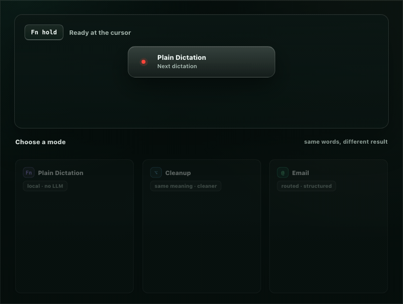
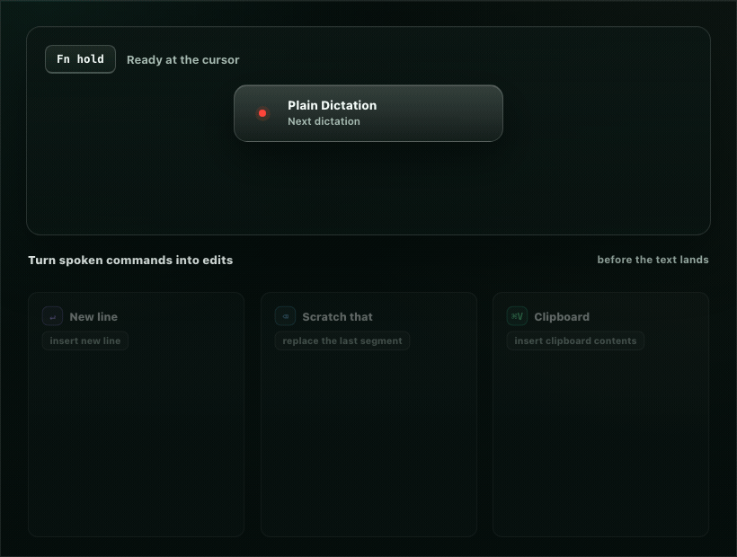

# KeyScribe

**Local-first voice dictation for macOS. On-device speech, no telemetry, powerful modes when you
want them.**

KeyScribe turns speech into finished text wherever you type. Hold a key, say the thought, release,
and the result lands in the app you're already using. Plain Dictation stays entirely on your Mac.
Optional rewrite modes can polish, format, or edit text through a provider and key you configure.

<p align="center">
  
</p>

## Install

### Homebrew

```bash
brew install rsperko/tap/keyscribe
```

> Homebrew 6+ can require trust for third-party taps. If prompted, confirm the tap, or run
> `brew tap rsperko/tap && brew trust --tap rsperko/tap` beforehand.

### Direct download

Download the latest notarized `KeyScribe-<version>.dmg` from
[Releases](https://github.com/rsperko/keyscribe/releases), open it, and drag **KeyScribe** to
Applications. Current binaries are pre-1.0 prereleases.

KeyScribe is a menu-bar app. After launch, look for the waveform glyph in the menu bar; there is no
Dock icon or main window.

## First Dictation

1. Launch KeyScribe.
2. Download an on-device speech model.
3. Grant Microphone, then Accessibility when prompted.
4. Focus any text field.
5. Hold `Fn (Globe)`, say one sentence, and release.

The whole dictation inserts as one unit, so one `Cmd-Z` removes it. If the Globe key opens Emoji,
Apple Dictation, or the input-source switcher, set the Globe action to "Do Nothing" in System
Settings > Keyboard, or choose `Right Option` in KeyScribe Settings.

Requirements: macOS 15+ on Apple silicon. Apple Speech, the zero-download system model, requires
macOS 26+.

## Why It Is Different

| Capability | What it means |
| --- | --- |
| **On-device speech only** | Audio never leaves your Mac. There is no cloud STT mode. |
| **No account, subscription, or telemetry** | KeyScribe does not collect usage, speech, transcripts, diagnostics, or crash reports. |
| **Plain Dictation without an LLM** | The default mode inserts local transcript text with live edits, vocabulary, and replacements. |
| **Modes instead of one global prompt** | Route by trigger key, app, URL, window title, menu choice, or spoken suffix such as `as an email`. |
| **Spoken edits before insertion** | Say line breaks, paragraphs, tabs, `scratch that`, verbatim spans, or `insert clipboard contents`. |
| **Optional BYOK rewrite** | Hosted or local OpenAI-compatible providers can polish, format, or rewrite text only for modes you enable. |
| **Plain files** | Config, modes, prompt fragments, vocabulary, replacements, and history live under `~/Library/Application Support/KeyScribe/`. |
| **Reproducible model testing** | Record your own corpus and compare on-device models against your voice. |

## Edit While Speaking

KeyScribe can turn spoken commands into local text edits before anything reaches the target app.
This works in Plain Dictation and does not require an LLM.

<p align="center">
  
</p>

Useful commands include:

- `insert new line`
- `insert new paragraph`
- `insert tab character`
- `scratch that`
- `insert clipboard contents`
- `begin verbatim ... end verbatim`

Clipboard insertion is tokenized like a verbatim span. In a rewrite mode, the model sees only a
placeholder; the clipboard text stays on your Mac and is restored locally into the final result.

## Modes

Modes are reusable pipeline presets. A mode can decide when it runs, which local transforms apply,
whether rewrite is enabled, which provider handles that rewrite, what context may be sent, and how
the result is inserted.

Good starter modes:

| Mode | Use it for | Requires rewrite |
| --- | --- | --- |
| Plain Dictation | Local transcript at the cursor. | No |
| Cleanup | Same meaning, cleaner text. | Yes |
| Email | A rough thought shaped into an email. | Yes |
| Edit Selection | Select text, speak an instruction, replace the selection. | Yes |
| Markdown | Notes with headings, bullets, and code fences. | Yes |
| Shell | A terminal-ready command inserted as text, never run by KeyScribe. | Yes |

End a dictation with a spoken suffix like `as an email`, choose a one-shot mode from the menu bar,
or bind the same key to different modes in different apps.

## Privacy Boundary

Speech recognition is always local. KeyScribe touches the network only for:

1. Downloading on-device speech model weights.
2. Optional BYOK rewrite calls for modes you enable.

When rewrite runs, the request goes to the provider or endpoint you configured. Saved API keys live
in macOS Keychain, local/no-auth endpoints are supported, and command-generated bearer tokens are
kept in memory only.

Best-effort redaction can tokenize recognizable sensitive spans before rewrite and restore them
locally afterward. It is pattern matching, not a security guarantee. Content that must never reach a
third-party provider should stay in Plain Dictation or another no-rewrite mode.

Full details: [PRIVACY.md](PRIVACY.md).

## Under the Hood

```text
hotkey -> microphone -> local STT -> local pipeline -> optional BYOK rewrite -> atomic insert
```

The local pipeline handles dictionary bias/recovery, replacements, spoken edits, verbatim spans,
clipboard tokenization, number normalization, and best-effort redaction. Rewrite, when enabled, is
validated before insertion so redaction/verbatim/clipboard tokens survive and restore correctly.

Supported speech models include Parakeet TDT v3, Parakeet TDT-CTC 110M, Whisper Large v3 Turbo,
Whisper Small (English), Apple Speech, Qwen3-ASR 0.6B, Qwen3-ASR 1.7B, and Moonshine Base
(English). Availability depends on macOS version and model download state.

## Build From Source

No Apple Developer account or paid certificate is required for a local build:

```bash
git clone https://github.com/rsperko/keyscribe.git
cd keyscribe
./make-app.sh && open ./KeyScribeDev.app
```

`make-app.sh` builds the dev variant so it can run alongside an installed KeyScribe. Build
prerequisites, signing options, release builds, and permission persistence are in [BUILD.md](BUILD.md).

## Documentation

- [docs/README.md](docs/README.md) — start here for the full documentation map.
- [docs/getting_started.md](docs/getting_started.md) — progressive ramp from first dictation to
  modes, privacy controls, and history.
- [PRIVACY.md](PRIVACY.md) — exact local/cloud boundary and redaction limits.
- [FAQ.md](FAQ.md) — first-run issues, permissions, model choice, and troubleshooting.
- [BUILD.md](BUILD.md) — building, signing, packaging, and release notes.
- [docs/reference/stt_benchmarks.md](docs/reference/stt_benchmarks.md) — reference model numbers and
  how to benchmark on your own voice.
- [docs/reference/advanced_configuration.md](docs/reference/advanced_configuration.md) and
  [docs/reference/config_schema.md](docs/reference/config_schema.md) — file-level configuration.
- [CONTRIBUTING.md](CONTRIBUTING.md) — project conventions and development entry points.

## License

KeyScribe is open source under [GPLv3](LICENSE). Third-party libraries and downloaded model weights
retain their own licenses; see [THIRD-PARTY-NOTICES.md](THIRD-PARTY-NOTICES.md).
